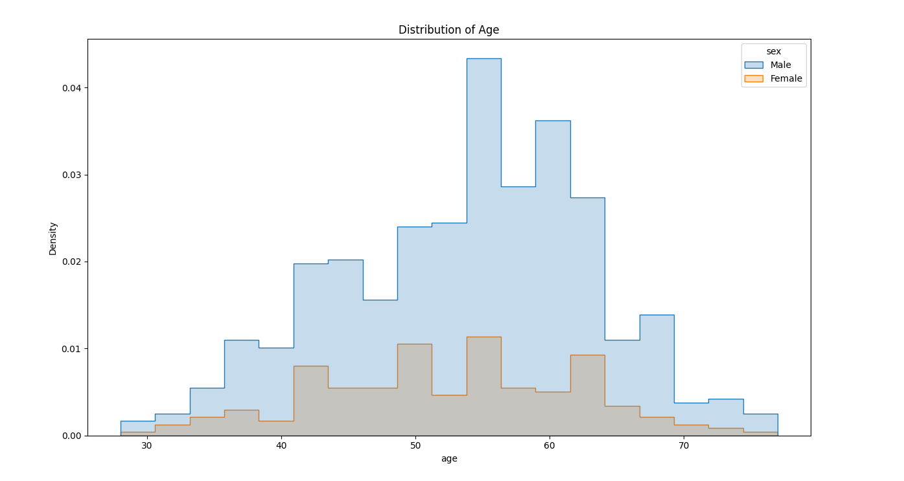

# Heart Disease Prediction Challenge

This repository contains a Python script for the Heart Disease Prediction Challenge from Kaggle.

## Dataset
The dataset used in this challenge is sourced from Kaggle. You can find the dataset [here](https://www.kaggle.com/datasets/redwankarimsony/heart-disease-data).

## Requirements
To run the Python script, you'll need the following dependencies installed:
- pandas
- numpy
- matplotlib
- seaborn
- plotly
- scikit-learn
- xgboost

You can install them using pip!

## Usage
1. Clone the repository.
2. Navigate to the directory containing the Python script.
3. Ensure the dataset file 'heart_disease_uci.csv' is in the same directory.
4. Run the Python script.

## About
This challenge was completed using Python, leveraging libraries such as pandas, numpy, and scikit-learn for data manipulation, visualization, and machine learning modeling.
